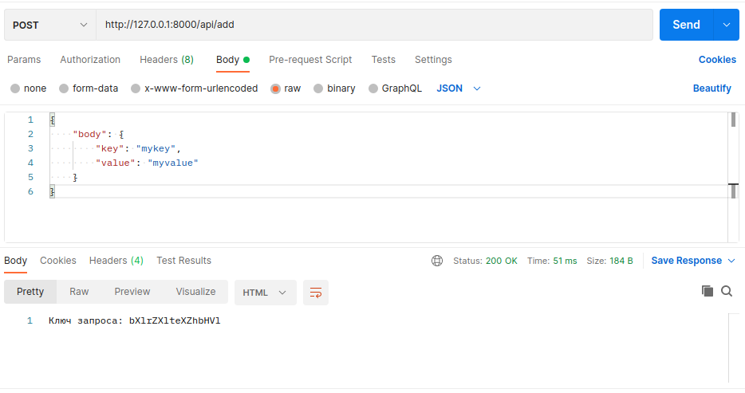
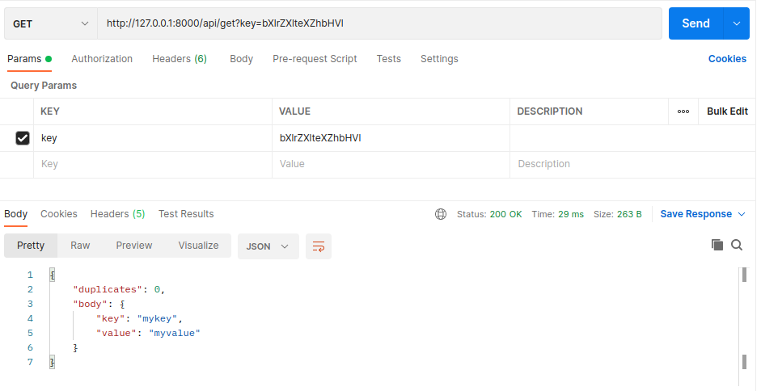
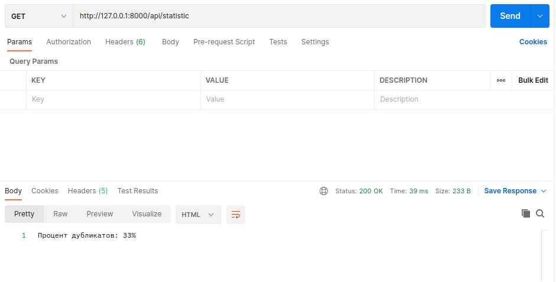
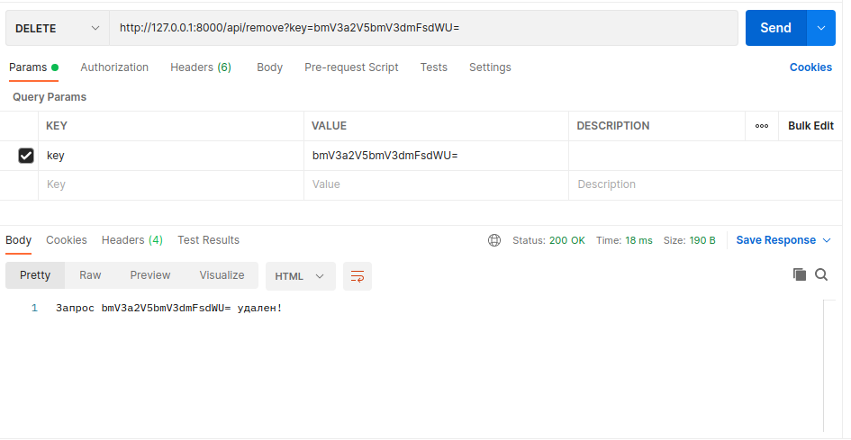
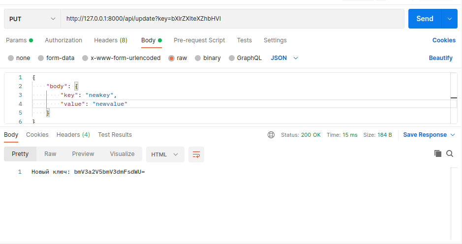

# betting_test

## Установка
```
git clone https://github.com/ottomayerpy/betting_test
cd betting_test
docker-compose up
```

## API

### POST
```
/api/add
```


### GET
```
/api/get?key=key
```


```
/api/statistic
```


### DELETE
```
/api/remove?key=key
```


### PUT
```
/api/update?key=key
```


